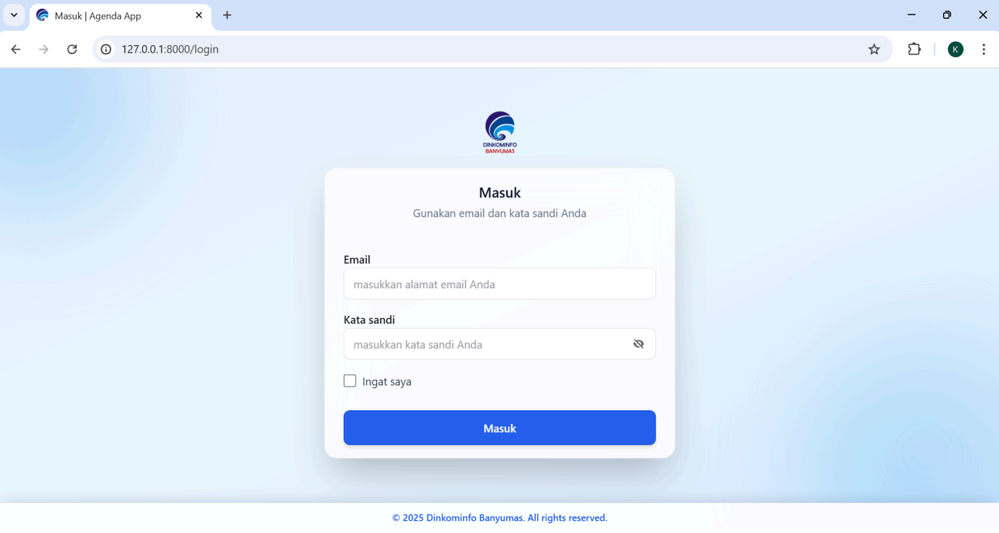
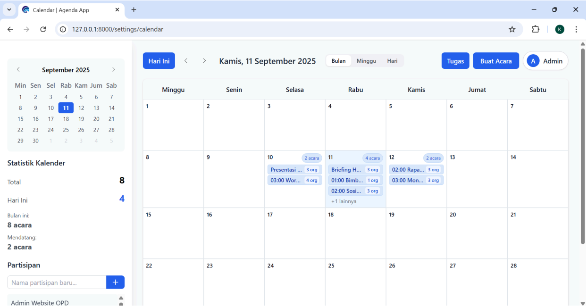
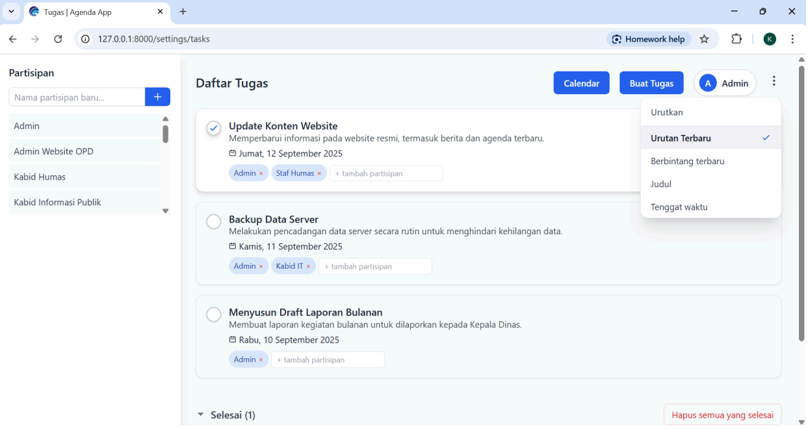
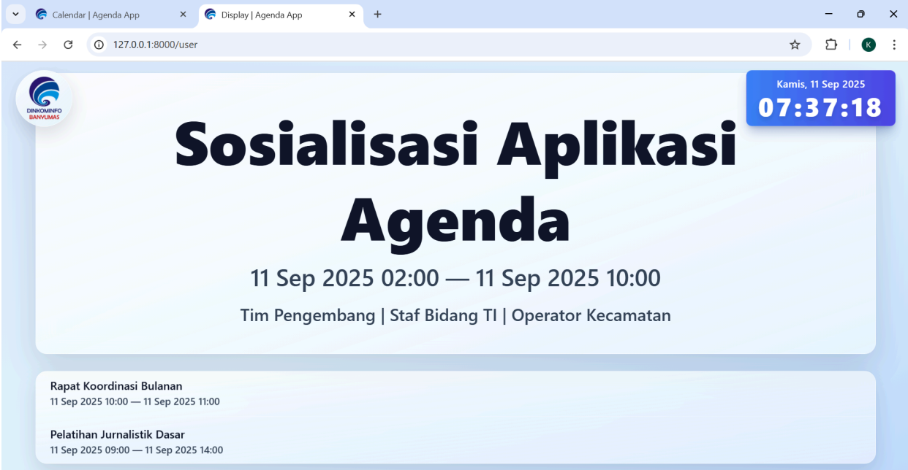

# 📅 Aplikasi Agenda Kominfo Banyumas

## 📌 Deskripsi
Aplikasi Agenda merupakan sistem berbasis web yang digunakan untuk menampilkan dan mengelola agenda kegiatan instansi secara terpusat, real-time, dan informatif.  

Aplikasi ini dikembangkan untuk membantu Dinas Komunikasi dan Informatika Kabupaten Banyumas dalam menyampaikan informasi kegiatan kepada pegawai secara lebih efektif melalui tampilan digital.

---

## 📖 Latar Belakang
Perkembangan teknologi informasi menuntut instansi pemerintah untuk menyampaikan informasi secara cepat, transparan, dan mudah diakses.  

Namun, penyampaian agenda kegiatan masih dilakukan secara manual, seperti melalui papan pengumuman atau komunikasi internal terbatas. Hal ini menyebabkan informasi tidak tersampaikan secara merata, keterlambatan update agenda, serta kurangnya dokumentasi yang terpusat.  

Oleh karena itu, dibutuhkan aplikasi agenda berbasis web yang mampu menyajikan informasi kegiatan secara real-time dan terstruktur.

---

## ❓ Rumusan Masalah
Bagaimana merancang aplikasi agenda berbasis web yang dapat:
- Menampilkan agenda kegiatan secara informatif  
- Mempermudah pengelolaan jadwal kegiatan  
- Menyajikan informasi secara real-time  

---

## 🎯 Tujuan
- Mengembangkan aplikasi agenda berbasis web  
- Mempermudah pengelolaan kegiatan instansi  
- Menyediakan informasi agenda secara transparan dan real-time  

---

## 🧠 Metode yang Digunakan
Pengembangan aplikasi ini menggunakan metode Waterfall yang terdiri dari beberapa tahapan, yaitu analisis kebutuhan, perancangan sistem, implementasi, pengujian, dan pemeliharaan. Metode ini dipilih karena memberikan alur kerja yang sistematis dan terstruktur dalam proses pengembangan perangkat lunak.

---

## 👥 Role Pengguna

### 🔹 Admin
- Mengelola agenda kegiatan (tambah, edit, hapus)  
- Mengelola tugas internal  
- Mengontrol tampilan display  
- Mengelola seluruh sistem  

---

## 📋 Fitur / Menu Aplikasi

### 🔹 1. Halaman Login

- Autentikasi pengguna (admin)  
- Validasi email dan password  

---

### 🔹 2. Calendar Admin

Fitur utama untuk mengelola agenda:
- Tampilan kalender (bulan, minggu, hari)  
- Tambah agenda kegiatan  
- Edit agenda  
- Hapus agenda  
- Menampilkan detail waktu & partisipan  

---

### 🔹 3. Tugas Admin

Fitur pencatatan tugas internal:
- Menambahkan tugas  
- Edit dan hapus tugas  
- Tandai tugas (prioritas / berbintang)  
- Pengurutan:
  - Terbaru  
  - Judul  
  - Tenggat waktu  

---

### 🔹 4. Display Utama

Tampilan publik untuk agenda:
- Menampilkan kegiatan secara real-time  
- Menampilkan:
  - Judul acara  
  - Waktu pelaksanaan  
  - Partisipan  
- Ditampilkan di layar TV / proyektor  
- Mendukung lebih dari 1 acara dalam 1 waktu  

---

## ⚙️ Cara Kerja Sistem
1. Admin login ke sistem  
2. Admin menginput agenda melalui Calendar  
3. Data agenda tersimpan di database  
4. Sistem menampilkan agenda ke Display Utama secara real-time  

---

## 🧪 Teknologi yang Digunakan
- Laravel  
- Livewire   
- Tailwind CSS 

---

## 📝 Kesimpulan
Aplikasi Agenda berbasis web ini mampu membantu instansi dalam mengelola dan menyampaikan informasi kegiatan secara lebih terstruktur, efisien, dan real-time. Sistem ini tidak hanya mempermudah admin dalam mengatur jadwal kegiatan, tetapi juga memastikan informasi agenda dapat diakses dengan jelas oleh seluruh pegawai melalui tampilan display utama. Dengan adanya aplikasi ini, proses penyampaian informasi menjadi lebih transparan dan mendukung digitalisasi layanan di lingkungan instansi.